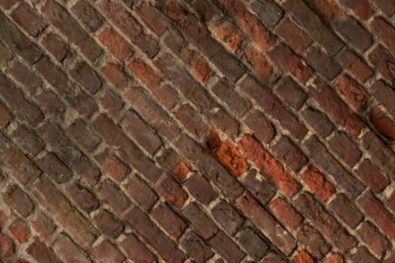
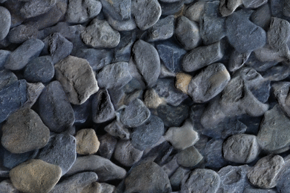
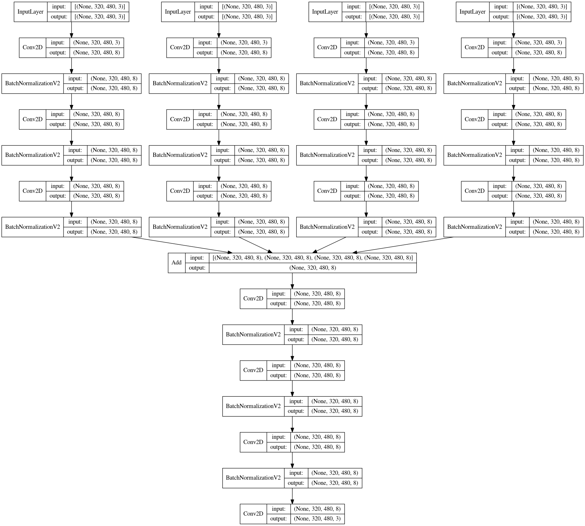
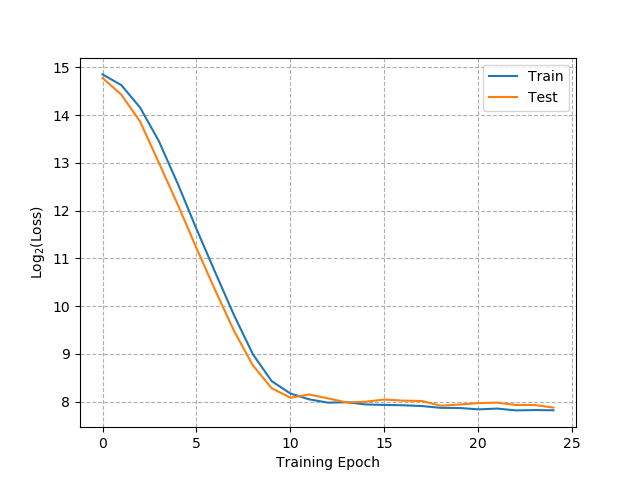
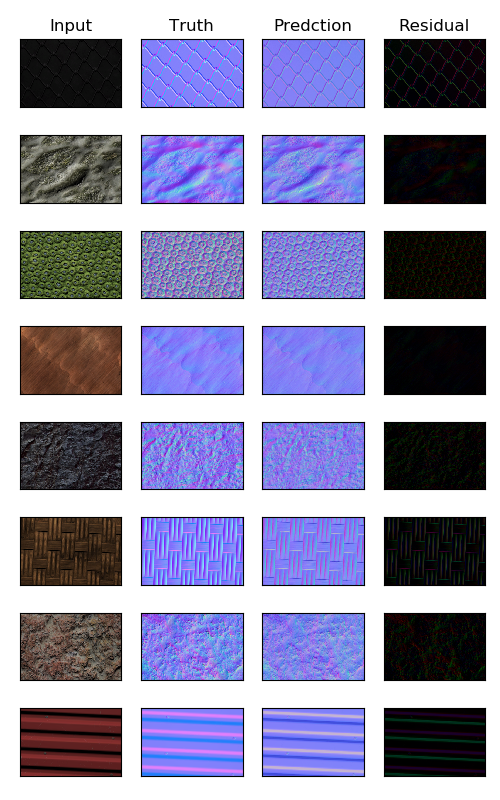
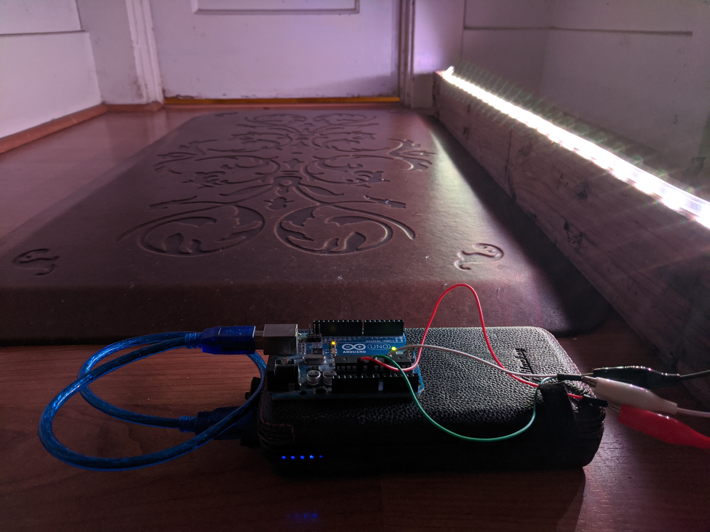
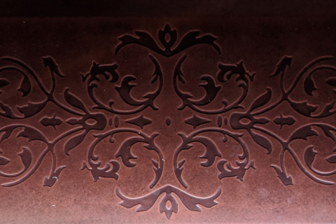

# 3D Material Synthesis
Estimate high resolution surface normals from a single view using multiple light sources. A convolutional approach is used to the estimate the surface geometry for photo-realistic rendering. Upload photos from your mobile phone and create materials for Unity3D or Blender.

## Dependencies 
- [Unity3D](https://unity.com/)
- [Python 3+](https://www.anaconda.com/distribution/) (tensorflow, numpy, Pillow, matplotlib)

## Generate Data with the [Universal Render Pipeline](https://docs.unity3d.com/Packages/com.unity.render-pipelines.universal@7.0/manual/index.html) in Unity3D

4 light sources are placed around a scene to mimic LEDs on a tripod-like structure


The lights turn on individually and a screenshot is captured for each. A labeled data set is created with the simulated images and their corresponding normal map.



The normal map encodes information about how bumpy or curved the surface is so that light can interact with it in a realistic manner. More information about normal maps be found here: https://docs.unity3d.com/Manual/StandardShaderMaterialParameterNormalMap.html


Here is the difference between a surface with and without a normal map while being illuminated with a directional light at 45 degrees 


## Finding Textures Online

The training data is composed of high resolution textures with normals from sources like https://www.substance3d.com/

A web crawler is created to find training data on websites that provide free textures
- https://3dtextures.me 
- https://cc0textures.com/
- https://www.cgbookcase.com/
- https://texturehaven.com/textures/

To use the script follow: 
```
python webscrape.py --BASE_URL https://3dtextures.me/ --PATTERN https://drive 
```

To download folders from a list of google drive links use: 

    python gdrive_download.py --file download_links.txt --dir train

Format the data and then import the directory `train/Textures/` into Unity `Resources/Textures`

    python format_data.py   

Use the script `ScreenCapture.cs` within Unity to generate training samples for a CNN. The training data is augmented within Unity to account for different perspectives & small distortions (e.g. rotations, translations and cropping). Set the file path before running the "TrainingSamples" scene. Ignore all moments Unity tries to convert the texture type to a normal map. The normal map will be set to the albedo/base map in order to generate a ground truth label. The rendering is wierd when generating a ground-truth if the normal map texture type is set to "normal map", just keep it as "default". 


## Machine learning model 

INPUT: 4 images 480 x 320 corresponding to light from 4 different angles

OUTPUT: 1 image 480 x 320 px corresponding to a normal map



The architecture of the neural network consists of a few convolutional layers, it looks more complex than it is due to the multiple inputs. 



The training was done by optimizing for the mean squared error using Adam with a batch size of 8 images. The neural network was trained with 1500 samples for 20 epochs on a GTX 1070 (total training time ~30 minutes). A total of 12,035 trainable parameters. 





* show unity comparison

## Use Cases

An LED strip with an arduino can simulate the training environment from Unity. A pyramid structure is required to stablize a camera and position the LED strip. A tutorial for how to construct a PVC frame is coming soon... Here is the first light with the Arduino: 



A sequence of pictures from a cell phone can be uploaded for the model to perform inference on

```python
from PIL import Image
import matplotlib.pyplot as plt
from model_train import build_cnn_encoder

if __name__ == "__main__":

    img = np.asarray(Image.open("test.jpg"))

    encoder = build_cnn_encoder( 
        input_dims=[(img.size[1],img.size[0],3)]*4, 
        layer_sizes=[ (8,8,8) ]*4,
        combined_layers = [8,8,8], 
        output_dim=(img.size[1],img.size[0],3)
    )

    encoder.load_weights("encoder_weights.h5") 
    output = encoder.predict([X0,X1,X2,X3])
    
```
The normal maps can then be rendered in Unity by creating a new material and setting the Base Map and Normal Map fields




An Arduino Uno with a NeoPixel LED strip is used to capture images with a mobile phone. The 
LED Strip is: https://www.adafruit.com/product/2562. More information about getting started with the NeoPixel Strip can be found here: https://learn.adafruit.com/adafruit-neopixel-uberguide. The code for the strip is here: 

```arduino
// https://learn.adafruit.com/adafruit-neopixel-uberguide/arduino-library-use
#include <Adafruit_NeoPixel.h>

#define LED_COUNT 30
Adafruit_NeoPixel strip(LED_COUNT, A0, NEO_GRB + NEO_KHZ800);

void setup() {
    Serial.begin(9600);
    strip.begin();
    for(int i=0; i<LED_COUNT; i++)
    {
        strip.setPixelColor(i,255,255,255);
    }
    strip.show();
    delay(100);
}

void loop() {
}
```


## Outstanding Research & Development
- Improve texture rendering 
    - higher resolution
    - curate textures for training
    - include height as vertex displacement
    - simulate LED bar

- Optimize the CNN
    - architecture
    - number of inputs
    - merge layer

- Construct a frame for stablizing capture on phone

### License
This software is intended strictly for educational purposes. Please cite this work if you use any of these algorithms for your project. Licensing fees may apply for any use beyond educational purposes, please contact support@digitaldream.io for more information
