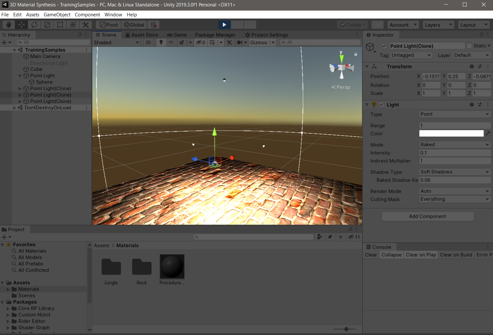
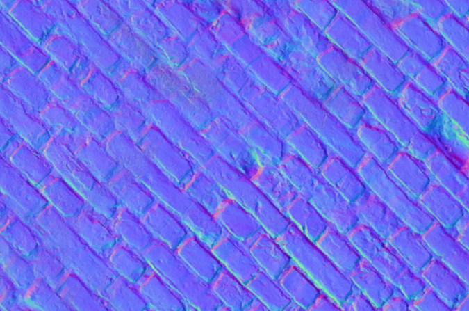
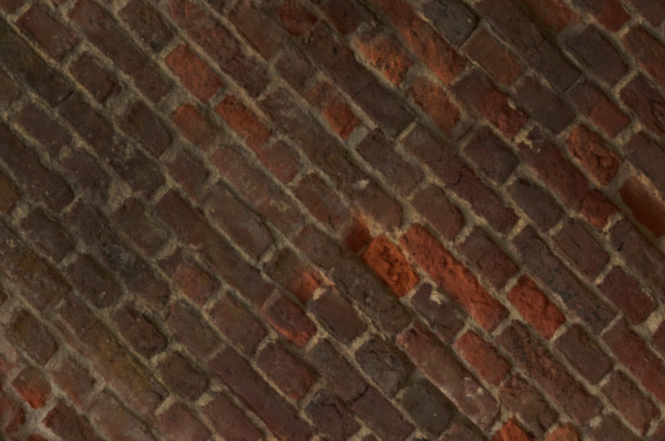

# 3D Material Synthesis
Estimate surface normals from a single view using multiple light sources and artificial intelligence.

## Generate Training Data with Unity 

4 point sources are placed around a scene to mimic LEDs on a tripod-like structure



The lights turn on individually and a screenshot is captured for each. These four images are input into a convolutional neural network in order to estimate a normal map.


A labeled data set is created with the simulated images and their corresponding normal map. The normal map encodes information about how bumpy or curved the surface is so that light can interact with it in a realistic manner. More information about normal maps be found here: https://docs.unity3d.com/Manual/StandardShaderMaterialParameterNormalMap.html



Here is the difference between a surface with and without a normal map while being illuminated with a directional light at 45 degrees 



## Finding Textures Online

The training data is composed of high resolution textures with normals from sources like https://www.substance3d.com/

A web crawler is created to find training data on websites that provide free textures
- https://3dtextures.me 
- https://cc0textures.com/
- https://www.cgbookcase.com/
- https://texturehaven.com/textures/

To use the script follow: 
```
python webscrape.py --BASE_URL https://3dtextures.me/ --PATTERN https://drive 
```

To download folders from a list of google drive links use: 

    python gdrive_download.py --file download_links.txt --dir train

Format the data and then import the directory `train/Textures/` into Unity

    python format_data.py   

Use the script `ScreenCapture.cs` within Unity to generate training samples for a CNN. The training data is augmented within Unity to account for different perspectives & small distortions (e.g. warps, rotations, translations and cropping).

## Machine learning model 

INPUT: 4 images 640 x 480 corresponding to light from 4 different angles

OUTPUT: 1 image 640 x 480 px corresponding to a normal map (a grayscale image)

The height map is then converted to a normal map using the formula: 
`
https://docs.unity3d.com/Packages/com.unity.shadergraph@5.7/manual/Normal-From-Height-Node.html
and in a custom shader graph 

## Real World Application
We are working on building a tripod light structure using a bluetooth controlled arduino and some LED strips in order to mimic our Unity simulation. A mobile app will allow you to run through the lighting sequence on your phone and capture data in the real world similar to how it was set up in Unity. This will allow one to create photo-realistic materials using their cellphone camera and an easy to build light stand. 